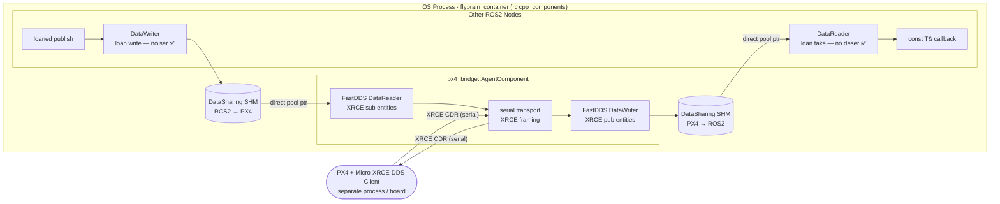
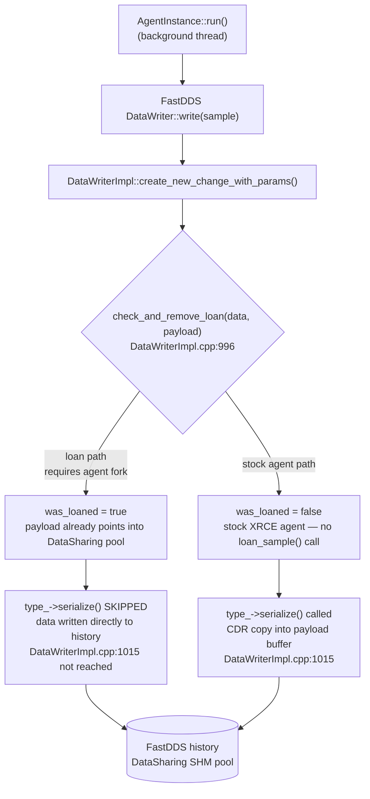
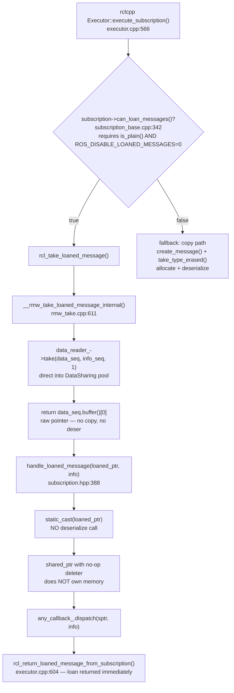
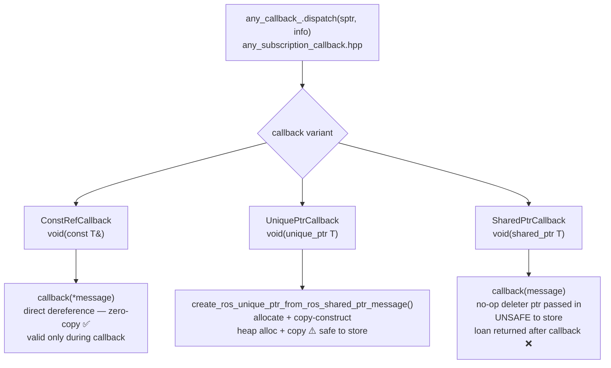
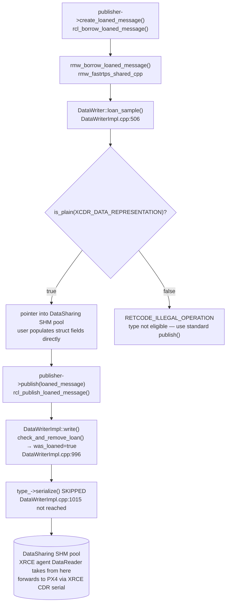

# Zero-Copy / Zero-Serialization DDS Plan
## Embedding Micro-XRCE-DDS-Agent as a ROS2 Composed Node

**Scope:** flybrain project, ROS2 Kilted, Fast-DDS v2.14.6, Micro-XRCE-DDS-Agent v2.4.3

---

## 1. Architecture Overview



**What is zero-copy / zero-deserialization here:**
The rmw_fastrtps + rclcpp subscription and publication layers. On subscribe: `rcl_take_loaned_message()` returns a raw pointer directly into the FastDDS DataSharing pool; `handle_loaned_message()` does a `static_cast` and passes it to the callback with a no-op deleter — `deserialize()` is never called. On publish: `create_loaned_message()` hands the publisher a pointer directly into the DataSharing pool; `publish(loaned_message)` sets `was_loaned=true` so `serialize()` is never called.

**What still involves encoding:**
The XRCE serial link. PX4 sends CDR-encoded payloads wrapped in XRCE framing. The agent strips XRCE headers and hands the CDR payload to a FastDDS DataWriter — one unavoidable parse of XRCE framing per direction. Symmetrically, when the agent receives from its DataReader and forwards to PX4, it re-encodes in XRCE framing before writing to serial.

**What this does NOT apply to:**
- Cross-machine traffic (intentional — full ser/deser when data leaves the process)
- Messages where `is_plain()` returns false (strings, vectors, variable-length arrays)
- Any node using rmw_zenoh or rmw_cyclonedds (neither supports the loan path)

---

## 2. What is a "Loan"?

> **Reference reading:**
> - [ROS2 Kilted — Configure Zero Copy Loaned Messages](https://docs.ros.org/en/kilted/How-To-Guides/Configure-ZeroCopy-loaned-messages.html) — high-level how-to
> - [ROS2 Design: Zero Copy via Loaned Messages](https://design.ros2.org/articles/zero_copy.html) — full design rationale and API specification

A **loaned message** is a block of memory borrowed directly from the FastDDS DataSharing pool instead of being allocated on the heap. The pool is a fixed-size POSIX shared-memory segment (mmap) that both the DataWriter and DataReader can access — no OS copy is needed to move data between them.

**Subscriber side — taking a loan:**

Normally, when a DataReader calls `take()`, FastDDS copies the data from its internal history into a freshly allocated buffer and calls `deserialize()` to convert CDR bytes into a C++ struct. With a loan, instead:

1. `take()` returns a pointer directly into the history buffer (which lives in the DataSharing pool)
2. No CDR deserialization happens — the struct is already laid out in memory the way C++ expects it, because `is_plain()` guarantees the memory layout matches CDR exactly
3. The caller owns the pointer only until it calls `return_loan()` — after that the pool reclaims the slot

In rclcpp, the executor calls `return_loan()` immediately after your callback returns. The `shared_ptr` your callback receives has a **no-op deleter** — it does nothing when the ref count hits zero. The actual memory is owned by the pool, not the `shared_ptr`. Storing that `shared_ptr` after the callback is undefined behavior.

**Publisher side — borrowing a loan:**

Normally, `publisher->publish(msg)` copies the struct into a CDR serialization buffer and hands those bytes to the DataWriter. With a loan:

1. `create_loaned_message()` returns a `LoanedMessage<T>` wrapping a pointer into the DataSharing pool
2. You populate the struct fields directly in pool memory — no intermediate copy
3. `publish(loaned_message)` hands ownership back; the DataWriter writes the entry to history with `was_loaned=true`, which causes `DataWriterImpl` to skip `type_->serialize()` entirely

**The `is_plain()` gate:**

Both paths require that `is_plain(XCDR_DATA_REPRESENTATION)` returns true for the message type. This compile-time constexpr check (generated into the PubSubTypes header) verifies that the struct's in-memory size and layout exactly match its CDR wire encoding — no padding, no variable-length fields. If it returns false, `loan_sample()` fails with `RETCODE_ILLEGAL_OPERATION` and the loan path is silently bypassed in rmw_fastrtps.

---

## 3. Prerequisites and Gating Conditions

### 3.1 RMW must be rmw_fastrtps_cpp

The loan path (`__init_subscription_for_loans`, `__rmw_take_loaned_message_internal`) is implemented only in rmw_fastrtps. Verify:

```bash
ros2 doctor --report | grep rmw
# or
echo $RMW_IMPLEMENTATION  # must be empty (default) or rmw_fastrtps_cpp
```

### 3.2 Message types must pass `is_plain()`

`rmw_fastrtps_shared_cpp/src/rmw_take.cpp:573-585` sets `can_loan_messages = info->type_support_->is_plain(XCDR_DATA_REPRESENTATION)`. If this returns false, the loan path is skipped silently and full deserialize occurs.

`is_plain()` returns true only for types where the struct memory layout exactly matches the CDR wire encoding — i.e., flat structs containing only primitive types and fixed-size arrays, with no padding surprises.

**Check after `colcon build`:**
```bash
# Generated PubSubTypes headers contain is_plain_xcdrv1_impl()
grep -r "is_plain_xcdrv1_impl" install/px4_msgs/include/ | head -20

# For a specific message, check the function body:
grep -A5 "is_plain_xcdrv1_impl" \
  install/px4_msgs/include/px4_msgs/msg/detail/sensor_combined__rosidl_typesupport_fastrtps_cpp.hpp
```

Messages that will NOT be plain (no loan support): any px4_msgs type with `string` fields or `sequence<>` in the IDL. Audit `px4_msgs/msg/*.msg` and maintain a list of which messages qualify.

### 3.3 `ROS_DISABLE_LOANED_MESSAGES` must be 0

Default is `1` (loans disabled globally). The rclcpp executor checks this at subscription creation time. Must be set in the launch environment before any node is initialized.

### 3.4 DataSharing must be enabled on both DataWriter and DataReader

The XRCE agent creates FastDDS DataWriter and DataReader entities; rmw_fastrtps creates the mirrored DataReader and DataWriter entities. Both sides of each pair must have DataSharing QoS enabled for the shared-memory pool to be established. This is configured via FastDDS XML profile (see Section 5).

---

## 4. Stack Traces: The Full Zero-Copy Path

Understanding the exact code path clarifies what must be true for zero-copy to hold end-to-end.

### 4.1 XRCE Agent DataWriter → DataSharing pool (PX4 → ROS2, write side)



For `was_loaned=true`, the agent would need to acquire a loaned sample via `DataWriter::loan_sample()` before writing. The stock XRCE agent does NOT do this — it writes by value, meaning one `serialize()` call happens on the write side. The DataSharing pool then holds the serialized CDR bytes.

**To achieve full writer-side zero-copy on this path:** patch the agent's FastDDS middleware to use `loan_sample()` before `write()`. This requires forking the agent. The base plan does not require this — reader-side zero-copy removes per-subscriber deserialization, which is the larger win when N nodes subscribe.

### 4.2 rmw DataReader → rclcpp callback (PX4 → ROS2, read side)

This is the primary zero-copy path — the one that eliminates per-subscriber deserialization.



The no-op deleter means the `shared_ptr` does NOT own the pool memory. The loan is returned the moment the callback stack unwinds. Storing the `shared_ptr` beyond the callback is undefined behavior.

### 4.3 Callback dispatch variants



### 4.4 rmw Publisher loaned write (ROS2 → PX4, write side)

This is the zero-copy publish path. The publisher writes directly into the DataSharing pool; the XRCE agent DataReader reads from the pool without copying.



**Usage:**
```cpp
auto loan = pub->create_loaned_message();  // LoanedMessage<T>
loan.get().field = value;                  // write directly into pool memory
pub->publish(std::move(loan));             // was_loaned=true, no serialize
```

---

## 5. FastDDS DataSharing XML Profile

DataSharing must be configured on both the XRCE agent's FastDDS entities and the rmw_fastrtps entities. Since both live in the same process and FastDDS reads XML profiles at entity creation time via `FASTDDS_DEFAULT_PROFILES_FILE`, a single XML file applies to both.

**File: `config/fastdds_datasharing.xml`**

```xml
<?xml version="1.0" encoding="UTF-8" ?>
<dds xmlns="http://www.eprosima.com/XMLSchemas/fastRTPS_Profiles">
  <profiles>
    <!-- Default publisher profile: enable DataSharing for all DataWriters -->
    <publisher profile_name="default_publisher" is_default_profile="true">
      <qos>
        <data_sharing>
          <kind>AUTOMATIC</kind>
        </data_sharing>
      </qos>
    </publisher>

    <!-- Default subscriber profile: enable DataSharing for all DataReaders -->
    <subscriber profile_name="default_subscriber" is_default_profile="true">
      <qos>
        <data_sharing>
          <kind>AUTOMATIC</kind>
        </data_sharing>
      </qos>
    </subscriber>
  </profiles>
</dds>
```

**`AUTOMATIC`** means FastDDS enables DataSharing when the type is eligible (is_plain + is_bounded) and falls back to standard transport otherwise — safe to apply globally.

The file path is passed via environment variable (see Section 8, Launch Configuration).

---

## 6. AgentComponent Implementation

The XRCE agent does not subclass `rclcpp::Node`. Use the NodeLikeListener pattern so the component loader can manage it without lifecycle overhead.

**File: `src/px4_bridge/include/px4_bridge/agent_component.hpp`**

```cpp
#pragma once

#include <memory>
#include <thread>
#include <vector>

#include "rclcpp/rclcpp.hpp"
#include "uxr/agent/AgentInstance.hpp"

namespace px4_bridge
{

class AgentComponent
{
public:
  explicit AgentComponent(const rclcpp::NodeOptions & options);
  ~AgentComponent();

  rclcpp::node_interfaces::NodeBaseInterface::SharedPtr get_node_base_interface() const;

private:
  rclcpp::Node::SharedPtr node_;
  std::thread agent_thread_;
};

}  // namespace px4_bridge
```

**File: `src/px4_bridge/src/agent_component.cpp`**

```cpp
#include "px4_bridge/agent_component.hpp"

#include <string>
#include <vector>

#include "rclcpp_components/register_node_macro.hpp"

namespace px4_bridge
{

AgentComponent::AgentComponent(const rclcpp::NodeOptions & options)
: node_(std::make_shared<rclcpp::Node>("xrce_agent", options))
{
  // Parameters drive the agent transport args.
  // Declare with defaults matching typical serial connection to PX4.
  node_->declare_parameter("transport", std::string("serial"));
  node_->declare_parameter("device", std::string("/dev/ttyS0"));
  node_->declare_parameter("baudrate", std::string("921600"));

  auto transport = node_->get_parameter("transport").as_string();
  auto device    = node_->get_parameter("device").as_string();
  auto baudrate  = node_->get_parameter("baudrate").as_string();

  // AgentInstance::create() expects argv-style args:
  // argv[0] = program name (ignored)
  // argv[1] = transport type
  // argv[2...] = transport-specific args
  //
  // Serial: MicroXRCEAgent serial -D /dev/ttyS0 -b 921600
  std::vector<std::string> arg_strings = {
    "MicroXRCEAgent", transport, "-D", device, "-b", baudrate
  };

  // AgentInstance::create() takes char**, build a mutable argv.
  std::vector<char*> argv;
  for (auto & s : arg_strings) {
    argv.push_back(s.data());
  }
  int argc = static_cast<int>(argv.size());

  eprosima::uxr::AgentInstance & agent = eprosima::uxr::AgentInstance::getInstance();
  if (!agent.create(argc, argv.data())) {
    throw std::runtime_error("Failed to create XRCE agent: check transport args");
  }

  // agent.run() blocks on agent_thread_.join(); run it off the main thread.
  agent_thread_ = std::thread([&agent]() {
    agent.run();
  });

  RCLCPP_INFO(node_->get_logger(), "XRCE agent running on %s %s @ %s baud",
    transport.c_str(), device.c_str(), baudrate.c_str());
}

AgentComponent::~AgentComponent()
{
  eprosima::uxr::AgentInstance::getInstance().stop();
  if (agent_thread_.joinable()) {
    agent_thread_.join();
  }
}

rclcpp::node_interfaces::NodeBaseInterface::SharedPtr
AgentComponent::get_node_base_interface() const
{
  return node_->get_node_base_interface();
}

}  // namespace px4_bridge

RCLCPP_COMPONENTS_REGISTER_NODE(px4_bridge::AgentComponent)
```

**Important:** `AgentInstance` is a singleton. Only one `AgentComponent` can exist per process. If the component container crashes and restarts with a second instance, `getInstance()` returns the same object — `create()` must be idempotent or the process must be restarted. This is expected behavior for the single-agent-per-process architecture.

---

## 7. Loan-Safe Subscription Factory

### 7.1 Type Traits

The safety wrapper uses `rclcpp::function_traits::function_traits<>` (a public rclcpp header) to extract the callback's first argument type at compile time, then `static_assert` that it is not a `shared_ptr` variant.

**File: `src/px4_bridge/include/px4_bridge/loan_safe_subscription.hpp`**

```cpp
#pragma once

#include <memory>
#include <type_traits>

#include "rclcpp/create_subscription.hpp"
#include "rclcpp/function_traits.hpp"
#include "rclcpp/node.hpp"
#include "rclcpp/qos.hpp"
#include "rclcpp/subscription.hpp"

namespace px4_bridge
{

// Detects whether T is a std::shared_ptr in any form.
// std::decay_t strips const and reference before the check,
// so shared_ptr<T>, shared_ptr<const T>, const shared_ptr<T>&,
// and const shared_ptr<const T>& are all caught.
template<typename T>
struct is_shared_ptr : std::false_type {};
template<typename T>
struct is_shared_ptr<std::shared_ptr<T>> : std::true_type {};
template<typename T>
struct is_shared_ptr<std::shared_ptr<const T>> : std::true_type {};


/// Drop-in for rclcpp::create_subscription that enforces loan-safe callback types.
///
/// With ROS_DISABLE_LOANED_MESSAGES=0 and DataSharing enabled, the executor passes
/// the message to the callback as a shared_ptr with a no-op deleter — the backing
/// memory is owned by the FastDDS DataSharing pool and the loan is returned
/// immediately after the callback returns. Storing that shared_ptr is undefined behavior.
///
/// This wrapper blocks registration of any callback whose first argument is a
/// shared_ptr, catching the unsafe pattern at compile time rather than at runtime.
///
/// Safe callback signatures:
///   void(const MessageT &)                         — zero-copy, preferred ✅
///   void(const MessageT &, const rclcpp::MessageInfo &)  — same, with metadata ✅
///   void(std::unique_ptr<MessageT>)                — safe, allocates+copies ⚠️
///   void(std::unique_ptr<MessageT>, const rclcpp::MessageInfo &)  — same ⚠️
///
/// Blocked callback signatures:
///   void(std::shared_ptr<MessageT>)                — unsafe to store ❌
///   void(std::shared_ptr<const MessageT>)          — unsafe to store ❌
///   void(const std::shared_ptr<const MessageT> &)  — unsafe to store ❌
template<typename MessageT, typename CallbackT, typename NodeT>
typename rclcpp::Subscription<MessageT>::SharedPtr
create_subscription(
  NodeT & node,
  const std::string & topic,
  const rclcpp::QoS & qos,
  CallbackT && callback,
  const rclcpp::SubscriptionOptionsWithAllocator<std::allocator<void>> & options =
    rclcpp::SubscriptionOptionsWithAllocator<std::allocator<void>>())
{
  using Traits = rclcpp::function_traits::function_traits<std::decay_t<CallbackT>>;
  using Arg0 = std::decay_t<typename Traits::template argument_type<0>>;

  static_assert(
    !is_shared_ptr<Arg0>::value,
    "\n\n"
    "  [px4_bridge] LOAN-UNSAFE CALLBACK DETECTED\n"
    "  shared_ptr callbacks are unsafe with loaned messages.\n"
    "  The shared_ptr has a no-op deleter — the backing memory is owned by the\n"
    "  FastDDS DataSharing pool and is reclaimed when the loan is returned,\n"
    "  immediately after your callback returns. Storing it is undefined behavior.\n\n"
    "  Use one of these safe signatures instead:\n"
    "    void(const MessageT &)                  <- zero-copy, preferred\n"
    "    void(std::unique_ptr<MessageT>)         <- safe copy, storable\n");

  return rclcpp::create_subscription<MessageT>(
    node, topic, qos,
    std::forward<CallbackT>(callback),
    options);
}

}  // namespace px4_bridge
```

### 7.2 Usage in Node Code

```cpp
// Instead of:
//   node->create_subscription<px4_msgs::msg::SensorCombined>(...)
// Use:
#include "px4_bridge/loan_safe_subscription.hpp"

// Zero-copy path — const ref, message valid only during callback:
px4_bridge::create_subscription<px4_msgs::msg::SensorCombined>(
  *node_, "fmu/out/sensor_combined", rclcpp::SensorDataQoS(),
  [this](const px4_msgs::msg::SensorCombined & msg) {
    process(msg);  // valid here
    // DO NOT: last_msg_ = &msg; — pointer invalid after return
  });

// If you need to store the message, use unique_ptr (allocates a copy):
px4_bridge::create_subscription<px4_msgs::msg::SensorCombined>(
  *node_, "fmu/out/sensor_combined", rclcpp::SensorDataQoS(),
  [this](std::unique_ptr<px4_msgs::msg::SensorCombined> msg) {
    last_msg_ = std::move(msg);  // safe to store — owns its memory
  });
```

### 7.3 Compile-time error example

```
error: static_assert failed:

  [px4_bridge] LOAN-UNSAFE CALLBACK DETECTED
  shared_ptr callbacks are unsafe with loaned messages.
  ...

note: in instantiation of function template specialization
  'px4_bridge::create_subscription<px4_msgs::msg::SensorCombined,
   (lambda at estimator_node.cpp:42:3), rclcpp::Node>'
```

---

## 8. Launch Configuration

### 8.1 Environment Variables

Two variables must be set before any node is initialized:

| Variable | Value | Effect |
|---|---|---|
| `ROS_DISABLE_LOANED_MESSAGES` | `0` | Enables the loan path in rclcpp executor (default `1` disables it) |
| `FASTDDS_DEFAULT_PROFILES_FILE` | path to `fastdds_datasharing.xml` | Enables DataSharing QoS on all FastDDS entities in the process |

### 8.2 Launch File

**File: `src/px4_bridge/launch/flybrain.launch.py`**

```python
import os
from launch import LaunchDescription
from launch.actions import SetEnvironmentVariable
from launch_ros.actions import ComposableNodeContainer
from launch_ros.descriptions import ComposableNode


def generate_launch_description():
    pkg_share = os.path.join(
        os.path.dirname(os.path.realpath(__file__)), '..', 'config')
    profiles_file = os.path.join(pkg_share, 'fastdds_datasharing.xml')

    return LaunchDescription([
        # Enable loan path in rclcpp executor
        SetEnvironmentVariable('ROS_DISABLE_LOANED_MESSAGES', '0'),
        # Enable DataSharing on all FastDDS entities in this process
        SetEnvironmentVariable('FASTDDS_DEFAULT_PROFILES_FILE', profiles_file),

        ComposableNodeContainer(
            name='flybrain_container',
            namespace='',
            package='rclcpp_components',
            executable='component_container',
            composable_node_descriptions=[
                ComposableNode(
                    package='px4_bridge',
                    plugin='px4_bridge::AgentComponent',
                    name='xrce_agent',
                    parameters=[{
                        'transport': 'serial',
                        'device': '/dev/ttyS0',
                        'baudrate': '921600',
                    }],
                ),
                # Add other composed nodes here.
                # They get DataSharing + loan path automatically.
            ],
        ),
    ])
```

---

## 9. CMakeLists.txt

**File: `src/px4_bridge/CMakeLists.txt`**

```cmake
cmake_minimum_required(VERSION 3.22)
project(px4_bridge)

find_package(ament_cmake REQUIRED)
find_package(rclcpp REQUIRED)
find_package(rclcpp_components REQUIRED)
find_package(px4_msgs REQUIRED)

# Micro-XRCE-DDS-Agent is not a ROS package — find via CMake
find_package(microxrcedds_agent REQUIRED)

add_library(agent_component SHARED
  src/agent_component.cpp)

target_include_directories(agent_component
  PUBLIC
    $<BUILD_INTERFACE:${CMAKE_CURRENT_SOURCE_DIR}/include>
    $<INSTALL_INTERFACE:include>)

ament_target_dependencies(agent_component
  rclcpp
  rclcpp_components)

target_link_libraries(agent_component
  microxrcedds_agent)

rclcpp_components_register_node(agent_component
  PLUGIN "px4_bridge::AgentComponent"
  EXECUTABLE agent_node)

# loan_safe_subscription.hpp is header-only; install it
install(DIRECTORY include/ DESTINATION include)

install(TARGETS agent_component
  ARCHIVE DESTINATION lib
  LIBRARY DESTINATION lib
  RUNTIME DESTINATION bin)

install(DIRECTORY launch config DESTINATION share/${PROJECT_NAME})

ament_package()
```

**File: `src/px4_bridge/package.xml`**

```xml
<?xml version="1.0"?>
<package format="3">
  <name>px4_bridge</name>
  <version>0.1.0</version>
  <description>Embedded XRCE agent + loan-safe subscription utilities</description>
  <maintainer email="rcmast3r1@gmail.com">ben</maintainer>
  <license>Apache-2.0</license>

  <buildtool_depend>ament_cmake</buildtool_depend>

  <depend>rclcpp</depend>
  <depend>rclcpp_components</depend>
  <depend>px4_msgs</depend>

  <build_type>ament_cmake</build_type>
</package>
```

---

## 10. Nix Integration

The Micro-XRCE-DDS-Agent is already packaged in `nix/micro-xrce-dds-agent.nix`. For `colcon` to find it during the ROS workspace build, it must be on `CMAKE_PREFIX_PATH` or installed into the ROS prefix.

Add to `flake.nix` devShell:

```nix
# In devShells.default shellHook, export agent for colcon:
shellHook = ''
  export CMAKE_PREFIX_PATH="${pkgs.micro-xrce-dds-agent}:$CMAKE_PREFIX_PATH"
  # ... existing shellHook content
'';
```

The `microxrcedds_agent` CMake package installed by `micro-xrce-dds-agent.nix` exposes `microxrcedds_agent::microxrcedds_agent` as the import target. If the CMake package name differs, check:

```bash
find $(nix-build -A micro-xrce-dds-agent)/lib/cmake -name "*.cmake" 2>/dev/null | head
```

---

## 11. Verification Checklist

After implementation, verify each layer of the chain.

### 11.1 DataSharing is established

```bash
# FastDDS logs DataSharing pool creation at INFO level.
# Set env var to see it:
FASTDDS_LOG_VERBOSITY_ERROR=0 \
FASTDDS_LOG_VERBOSITY_WARNING=0 \
ros2 launch px4_bridge flybrain.launch.py 2>&1 | grep -i "data.shar"
# Expect: "Data sharing activated" or "DataSharingPayloadPool"
```

### 11.2 Loan path is active (subscribe side)

```bash
# rclcpp emits a WARN_ONCE when loans are active (subscription_base.cpp:342-358).
# The warning text is:
# "only safe with const ref subscription callbacks"
# Its presence confirms the loan branch was taken.
ros2 launch px4_bridge flybrain.launch.py 2>&1 | grep -i "loan"
```

### 11.3 `is_plain()` check passes for target messages

```bash
# After colcon build, grep the generated type support:
grep -A3 "is_plain" \
  install/px4_msgs/include/px4_msgs/px4_msgs/msg/detail/sensor_combined__rosidl_typesupport_fastrtps_cpp.hpp
# Expect: return true (or a constexpr size check that evaluates to true)
```

### 11.4 `ROS_DISABLE_LOANED_MESSAGES` is seen by the executor

```bash
# Confirm by temporarily setting it to 1 and verifying the WARN_ONCE disappears.
ROS_DISABLE_LOANED_MESSAGES=1 ros2 launch px4_bridge flybrain.launch.py 2>&1 | grep -i "loan"
# Expect: no loan warning (loans disabled, fallback to copy path)
```

### 11.5 Compile-time enforcement catches shared_ptr callbacks

```cpp
// This must fail to compile:
px4_bridge::create_subscription<px4_msgs::msg::SensorCombined>(
  *node_, "topic", qos,
  [](std::shared_ptr<px4_msgs::msg::SensorCombined> msg) { (void)msg; });
// Expected: static_assert: [px4_bridge] LOAN-UNSAFE CALLBACK DETECTED
```

---

## 12. Limitations and Constraints

| Constraint | Detail |
|---|---|
| Same machine only | DataSharing uses POSIX SHM (mmap). Cross-machine traffic falls back to UDP — full ser/deser as expected. |
| `is_plain()` types only | Any px4_msgs type with `string` or `sequence<>` fields silently falls back to copy path. Audit IDL files. |
| `rmw_fastrtps_cpp` required | rmw_zenoh always serializes/deserializes (confirmed via source). rmw_cyclonedds has no loan support. Do not switch RMW. |
| const-ref callbacks: read-only during callback | The loan is returned immediately after callback returns. Do not capture `&msg` into a lambda or store it as a pointer. |
| unique_ptr callbacks: safe but copies | `AnySubscriptionCallback::dispatch()` for unique_ptr calls `create_ros_unique_ptr_from_ros_shared_ptr_message()` which heap-allocates and copies. Safe to store; not zero-copy. |
| One agent per process | `AgentInstance` is a singleton. Only one `AgentComponent` per container. |
| Writer-side zero-copy (XRCE→DDS): not included | The stock XRCE agent calls `DataWriter::write()` by value (one `serialize()` call). Writer-side loan on the PX4→ROS2 path requires forking the agent's FastDDS middleware. Left as a future optimization. |
| XRCE CDR framing overhead | The serial XRCE framing parse/encode is unavoidable in both directions. This is the intended protocol boundary. |

---

## 13. Source References

All claims in this document are grounded in these source locations:

| Claim | Source |
|---|---|
| Writer loan skips `serialize()` | `Fast-DDS/src/cpp/fastdds/publisher/DataWriterImpl.cpp:996-1027` |
| `loan_sample()` gated on `is_plain()` | `DataWriterImpl.cpp:506` |
| rmw sets `can_loan_messages` from `is_plain()` | `rmw_fastrtps/rmw_fastrtps_shared_cpp/src/rmw_take.cpp:573-585` |
| rmw loan take returns raw pool pointer | `rmw_take.cpp:611-633` |
| rclcpp executor loan branch | `rclcpp/src/rclcpp/executor.cpp:566-604` |
| `handle_loaned_message()` is pure cast | `rclcpp/include/rclcpp/subscription.hpp:388-417` |
| Loan returned immediately after callback | `executor.cpp:604` (`rcl_return_loaned_message_from_subscription`) |
| `unique_ptr` callback heap-copies | `rclcpp/include/rclcpp/any_subscription_callback.hpp:494-501` |
| `shared_ptr` callback passes no-op deleter | `any_subscription_callback.hpp:624-629` |
| rmw_zenoh always serializes | `rmw_zenoh/rmw_zenoh_cpp/src/detail/rmw_publisher_data.cpp:628-636` |
| rmw_zenoh always deserializes + memcpy | `rmw_zenoh/rmw_zenoh_cpp/src/detail/rmw_subscription_data.cpp:986, 1009-1020` |
| Callback type deduction | `rclcpp/include/rclcpp/detail/subscription_callback_type_helper.hpp` |
| `function_traits` arg extraction | `rclcpp/include/rclcpp/function_traits.hpp` |
| NodeLikeListener pattern | `demos/composition/src/node_like_listener_component.cpp` |
| `AgentInstance` API | `Micro-XRCE-DDS-Agent/include/uxr/agent/AgentInstance.hpp` |
| Agent transport types (no SHM) | `Micro-XRCE-DDS-Agent/src/cpp/AgentInstance.cpp` |
| `add_middleware_callback` lifecycle-only | `Micro-XRCE-DDS-Agent/include/uxr/agent/middleware/utils/Callbacks.hpp` |
